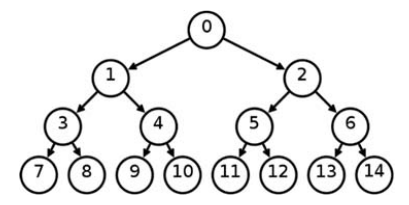

<!--
vim: tabstop=4 shiftwidth=4
-->
# Lab 07 exercise 02
Implement a C program, `thread_generation`, which that receives a
command line parameter `n`.
The parent thread creates two threads and waits for their termination.
Each thread creates another two threads, and waits for their termination.
__Tread creation stops after 2^`n` leave threads have been created.__
For example, if __`n`=3__, the main thread creates two threads, and each thread
creates another two threads for a total number of 8 leaves treads.
At this point, thread creation stops.



Only the leaf threads print their thread identifier.
```
> thread_generation 3
3077876592
3035790192
3052575600
3027397488
3060968304
3019004784
3044182896
3010612080
```
