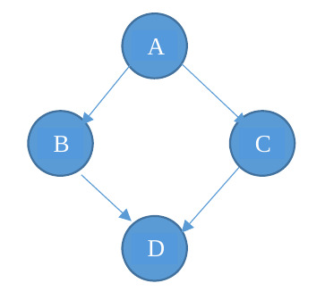

<!--
vim: tabstop=4 shiftwidth=4
-->
# Lab 11 exercise 01
Implements the following **precedence graph** with threads and
POSIX **semaphores**.
Each circle represent a thread created by the main thread.
The main thread waits the termination of these four threads.
Each thread prints, after a random interval `[0-1000]` **milliseconds**,
the corresponding character in the figure.
Run the program several times to assess that it will always print either
ABCD or ACBD.

