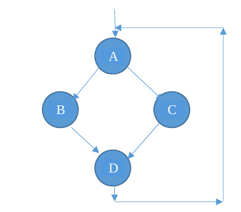

<!--
vim: tabstop=4 shiftwidth=4
-->
# Lab 11 exercise 02
Implements the following precedence graph with **cyclic threads** and POSIX
semaphores.  
Each circle represent a thread created by the main thread, which terminates
after the creation of these four threads.  
Each thread prints, after a random interval [0-1000] **milliseconds**,
the corresponding character in the figure.  
Each thread loops 10 times, then it terminates.

