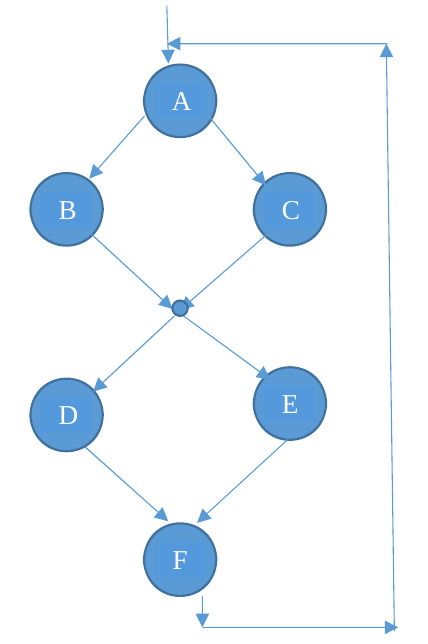

<!--
vim: tabstop=4 shiftwidth=4
-->
# Lab 11 exercise 03
Implements the following precedence graph with **cyclic threads** and POSIX
semaphores.
Each circle represent a thread created by the main thread, which terminates
after the creation of these six threads.  
Each thread prints, after a random interval [0-1000] **milliseconds**, the
corresponding character in the figure.  
Each thread loops `N` times (`N` given as an argument of the command line),
then it terminates.

Please notice that **the small circle is not a thread**, just a synchronization
point among threads B, C, D, and E.

Possible outputs:
**A B C D E F   A C B D E F   A C B E D F** ... etc.
